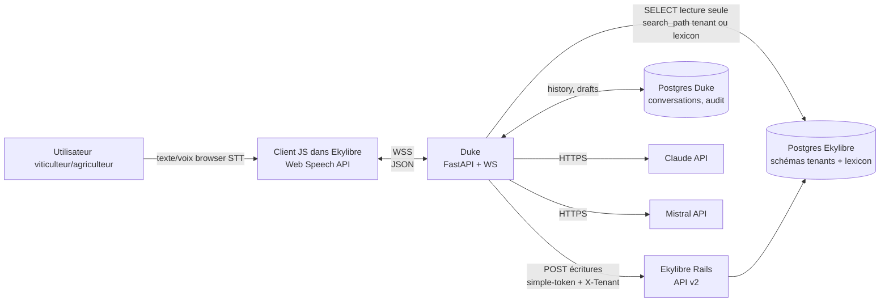
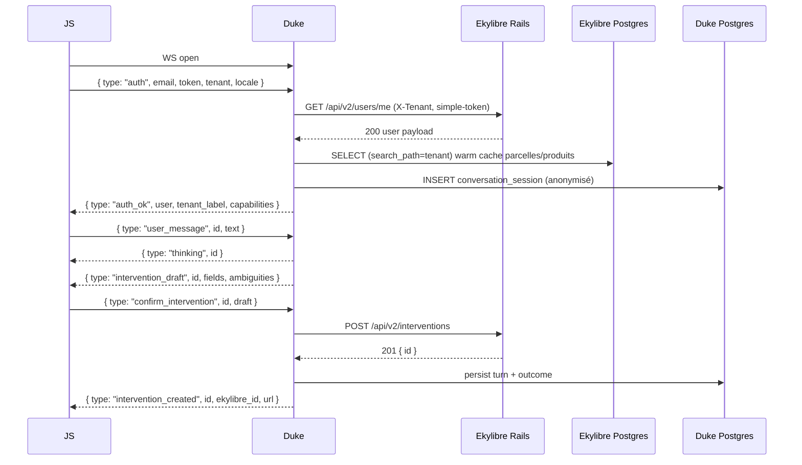
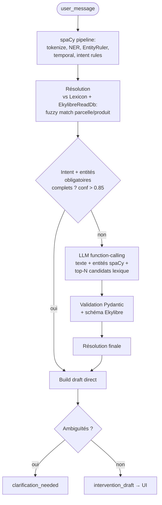
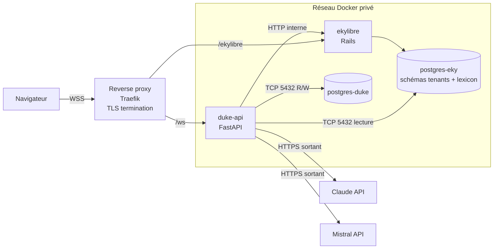

# Duke — Architecture

> Document de conception produit par `/sc:design` le 2026-05-07. Entrée : `REQUIREMENTS.md` (v2, toutes décisions tranchées). Sortie : à utiliser avec `/sc:implement`.

---

## 1. Vue d'ensemble



**Principe directeur :**
- **Lecture = Postgres direct** (réseau privé Docker, compte read-only) pour Q&A et lexique.
- **Écriture = API REST Ekylibre** (jamais d'INSERT direct ; on respecte les interactors et la logique métier de `Interventions::BuildInterventionInteractor`).
- **Duke a sa propre base Postgres** pour la persistance conversationnelle (séparation stricte des données métier Ekylibre et des logs/historiques Duke).

---

## 2. Couches du service Python

Architecture hexagonale légère : domaine pur au centre, ports/adaptateurs en périphérie.

```
┌─────────────────────────────────────────────────────────────────┐
│                     Transport (FastAPI)                          │
│  WebSocket /ws  │  HTTP /healthz /readyz /metrics               │
└──────────────────┬──────────────────────────────────────────────┘
                   │
┌──────────────────▼──────────────────────────────────────────────┐
│                       Application                                │
│  SessionManager  │  ConversationOrchestrator                     │
│  InterventionRecorder  │  QueryAnswerer                          │
└──────┬────────────────────────────────┬─────────────────────────┘
       │                                │
┌──────▼─────────┐         ┌────────────▼────────────────────────┐
│   NLU layer    │         │   Integration layer (ports)         │
│  spaCy pipeline│         │  EkylibreApiClient (writes)         │
│  LLM Router    │         │  EkylibreReadDb (reads)             │
│  EntityRuler   │         │  LexiconRepository                  │
│  Temporal FR   │         │  ClaudeProvider, MistralProvider    │
│  Intent rules  │         │  ConversationStore (Postgres Duke)  │
└──────┬─────────┘         └────────────┬────────────────────────┘
       │                                │
┌──────▼────────────────────────────────▼────────────────────────┐
│                       Domain (pur)                              │
│  Intent  Entity  Conversation  InterventionDraft  ...           │
└─────────────────────────────────────────────────────────────────┘
```

### 2.1 Transport
- **FastAPI** + **uvicorn**. Endpoint unique WS `/ws`. Token jamais en query string.
- HTTP : `GET /healthz` (vivacité), `GET /readyz` (DB Duke + Ekylibre joignables + lexique chargé), `GET /metrics` (Prometheus).

### 2.2 Application
- `SessionManager` : registre des sessions WS, cycle de vie (auth → ready → closed), expiration sur inactivité.
- `ConversationOrchestrator` : pilote NLU → action → réponse, émet les événements WS, persiste les tours dans `ConversationStore`.
- `InterventionRecorder` : use case « créer une intervention » via API Ekylibre.
- `QueryAnswerer` : use case « répondre à une question » via `EkylibreReadDb` + LLM pour la mise en forme.

### 2.3 NLU
Voir §4.

### 2.4 Integration (ports + adapters)
- `EkylibreApiClient` : adaptateur HTTP pour les **écritures** (POST intervention) + validation token (`/api/v2/users/me`).
- `EkylibreReadDb` : adaptateur Postgres lecture seule pour les **données tenants** (Q&A) — gestion stricte du `search_path` Apartment.
- `LexiconRepository` : adaptateur Postgres lecture seule pour le **schéma `lexicon`** partagé (master data : produits, procédures, unités).
- `LLMRouter` + `LLMProvider` : routeur multi-provider (Claude, Mistral) avec sélection par config ou par session.
- `ConversationStore` : impl Postgres (DB Duke) — historiques, drafts, audit.

### 2.5 Domain
Modèles Pydantic v2 purs (pas d'I/O). Exemples :

```python
class InterventionDraft(BaseModel):
    procedure_name: str | None
    started_at: datetime | None
    stopped_at: datetime | None
    working_duration: timedelta | None
    targets: list[ResolvedTarget]
    inputs: list[ResolvedInput]
    doers: list[ResolvedDoer]
    tools: list[ResolvedTool]
    ambiguities: list[Ambiguity]
    confidence: float
```

### 2.6 Stack Python concrète

| Préoccupation | Choix |
|---|---|
| Web/WS | FastAPI + uvicorn[standard] |
| Validation/DTO | Pydantic v2 |
| HTTP client | httpx (async) |
| Postgres | asyncpg + SQLAlchemy 2.x async (DB Duke) ; asyncpg seul + requêtes paramétrées (Ekylibre) |
| Migrations DB Duke | Alembic |
| NLU | spaCy + `fr_core_news_lg` (MVP), évolution `fr_dep_news_trf` + NER custom |
| LLM SDKs | Anthropic SDK + Mistral client |
| Logs | structlog (JSON) |
| Metrics | prometheus_client |
| Config | pydantic-settings |
| Tests | pytest + pytest-asyncio + httpx mock + testcontainers Postgres |
| Packaging | uv + pyproject.toml, Python 3.12+ |
| Lint/format | ruff + ruff-format |

### 2.7 Arborescence proposée

```
duke/
├── pyproject.toml
├── README.md
├── REQUIREMENTS.md
├── ARCHITECTURE.md
├── alembic.ini
├── alembic/
│   └── versions/
├── docker/
│   ├── Dockerfile
│   └── docker-compose.yml
├── src/duke/
│   ├── main.py                    # app factory FastAPI
│   ├── config.py                  # Settings pydantic-settings
│   ├── transport/
│   │   ├── ws_server.py
│   │   └── messages.py
│   ├── application/
│   │   ├── session.py
│   │   ├── orchestrator.py
│   │   ├── intervention_recorder.py
│   │   └── query_answerer.py
│   ├── nlu/
│   │   ├── pipeline.py            # spaCy nlp builder
│   │   ├── entity_ruler.py        # patterns depuis lexique
│   │   ├── temporal.py            # « ce matin », « hier 14h »…
│   │   ├── intent_classifier.py
│   │   └── llm/
│   │       ├── base.py            # interface LLMProvider
│   │       ├── router.py          # LLMRouter (Claude / Mistral)
│   │       ├── claude.py
│   │       ├── mistral.py
│   │       ├── prompts.py
│   │       └── tools.py           # JSON Schemas function calling
│   ├── domain/
│   │   ├── intent.py
│   │   ├── entities.py
│   │   ├── conversation.py
│   │   └── intervention.py
│   ├── integration/
│   │   ├── ekylibre/
│   │   │   ├── api_client.py      # writes + auth
│   │   │   ├── read_db.py         # Postgres read-only data path
│   │   │   ├── lexicon_repo.py    # Postgres lecture schéma lexicon
│   │   │   └── mappers.py         # InterventionDraft → API payload
│   │   └── store/
│   │       ├── models.py          # SQLAlchemy ORM (DB Duke)
│   │       ├── repositories.py
│   │       └── retention.py       # purge / anonymisation
│   └── observability/
│       ├── logging.py
│       └── metrics.py
└── tests/
    ├── unit/
    ├── integration/
    └── fixtures/
        └── golden_phrases.yaml    # corpus d'évaluation NLU
```

---

## 3. Contrat WebSocket

### 3.1 Principes
- Un message JSON par frame. UTF-8.
- Tout message a `type` (discriminant) et `id` corrélant requête/réponses.
- Token Ekylibre **jamais** en query string ni en log. Toujours dans le payload du message `auth`.
- Streaming token-par-token pour la génération Q&A.

### 3.2 Cycle de vie d'une session



### 3.3 Messages — schémas

**Client → Serveur**

| `type` | Champs | Description |
|---|---|---|
| `auth` | `email`, `token`, `tenant`, `locale?` | Premier message obligatoire. `email` est requis : Ekylibre valide le `simple-token <email> <token>` et a besoin des deux. |
| `user_message` | `id`, `text` | Phrase utilisateur (texte ou STT navigateur). |
| `confirm_intervention` | `id`, `draft` (édité) | Validation/édition du draft. |
| `clarify` | `id`, `answer` | Réponse à une question de désambiguïsation. |
| `cancel` | `id` | Annule un tour en cours. |
| `ping` | — | Heartbeat. |

**Serveur → Client**

| `type` | Champs | Description |
|---|---|---|
| `auth_ok` | `user`, `tenant_label`, `capabilities`, `llm_provider` | Auth validée. `llm_provider` indique le routage actif. |
| `auth_error` | `code`, `message` | Token invalide / tenant inconnu. Suivi de close. |
| `thinking` | `id` | Indicateur d'activité. |
| `assistant_token` | `id`, `delta` | Token LLM streaming (Q&A). |
| `assistant_message` | `id`, `text`, `final: true` | Message final consolidé. |
| `intervention_draft` | `id`, `fields`, `ambiguities`, `confidence` | Fiche reconstituée. |
| `clarification_needed` | `id`, `question`, `options?` | Question de levée d'ambiguïté. |
| `intervention_created` | `id`, `ekylibre_id`, `url` | POST Ekylibre OK. |
| `out_of_scope` | `id`, `reason`, `suggestion?` | Hors périmètre (US-4). |
| `error` | `id?`, `code`, `message`, `retryable` | Erreur métier ou technique. |
| `pong` | — | Réponse à ping. |

**Codes d'erreur réservés** : `AUTH_INVALID_TOKEN`, `AUTH_TENANT_UNKNOWN`, `EKYLIBRE_UNAVAILABLE`, `EKYLIBRE_API_ERROR`, `EKYLIBRE_DB_UNAVAILABLE`, `LLM_UNAVAILABLE`, `RATE_LIMITED`, `INTERNAL`.

### 3.4 Règles de robustesse
- Timeout d'auth : 10 s après l'ouverture WS, sinon `close 1008`.
- Heartbeat : `ping`/`pong` toutes les 30 s ; déconnexion après 2 misses.
- Une seule requête `user_message` à la fois par session ; un `cancel` interrompt celle en cours.
- Backpressure LLM : `thinking` toutes les 5 s si latence > 10 s.

---

## 4. Orchestration NLU (spaCy + LLM)

### 4.1 Stratégie « cheap first, smart fallback »



### 4.2 Composants spaCy

**Roadmap NLU** (acté en Q3) :
1. **MVP** : `fr_core_news_lg` + EntityRuler dynamique alimenté par le lexique + composant temporel FR custom + intent par règles.
2. **Itération 7** : infrastructure d'entraînement NER agricole — corpus golden annoté, synthétiseur templates × lexique, CLI `duke.cli.train_ner` ; le modèle entraîné est chargé via `Settings.duke_ner_model_path` à la place du base model. EntityRuler reste en overlay (priorité aux hits lexique exacts pour la résolution d'ID).
3. **Phase 2** : bascule `fr_dep_news_trf` (transformer) une fois le corpus enrichi suffisamment par retours utilisateurs (cf. §9.2).
4. La pipeline spaCy est versionnée (`Settings.spacy_model` + `Settings.duke_ner_model_path`) et chargée à la création du service — bascule sans changement de code.

**Composants** :
- **EntityRuler** : patterns générés à chaud depuis `LexiconRepository` (produits, procédures, unités, cultures) + depuis `EkylibreReadDb` pour les noms propres du tenant (parcelles, activités, équipements). Reconstruit à l'auth de session ; rafraîchi toutes les 5 min.
- **Composant temporel** : reconnaît expressions FR (« ce matin » → tranche horaire 06h–12h, « hier après-midi », « la semaine du 12 mars », « pendant 1h30 »). Sortie structurée : `started_at`/`stopped_at`/`working_duration`.
- **Intent classifier** : règles + patterns. Si rappel < 0.85 sur golden set, basculer vers TextCategorizer spaCy entraîné.

### 4.3 LLM Router (Claude + Mistral) — décision Q1

Interface :

```python
class LLMProvider(Protocol):
    name: str  # "claude" | "mistral"
    async def extract_intervention(
        self, text: str, hints: SpacyHints, schema: dict
    ) -> InterventionExtraction: ...
    async def answer_query(
        self, text: str, evidence: list[QueryResult], history: list[Turn]
    ) -> AsyncIterator[str]: ...
    async def health(self) -> bool: ...
```

**Routage** :
- Variable `LLM_DEFAULT_PROVIDER` (`claude` | `mistral`).
- Override possible **par tenant** via une table `tenant_llm_preference` dans la DB Duke (cas : tenant exigeant la souveraineté FR → Mistral forcé).
- Override **par type de tâche** : extraction d'intervention (function calling exigeant) → préférence Claude par défaut ; génération Q&A (texte libre) → indifférent.
- **Fallback automatique** : si le provider primaire échoue (timeout, 5xx, quota), bascule transparente vers le secondaire ; un `error` final n'est émis que si les deux échouent.

**Function calling** :
- Schéma `InterventionDraft` exposé comme tool aux deux providers.
- Mistral function calling moins mature que Claude ; valider sur le golden set lors de l'implémentation. Si écart > 5 points F1, restreindre Mistral au Q&A et garder Claude pour l'extraction.

**Prompt caching** :
- Activé sur la partie système (schéma JSON, instructions, contexte tenant peu changeant). Côté Claude via le SDK Anthropic ; côté Mistral si supporté à la date d'implémentation.

### 4.4 Garde-fous
- **Pas d'écriture sans confirmation utilisateur** (NFR).
- **Validation Pydantic stricte** sur la sortie LLM ; toute incohérence devient une `ambiguity`.
- **Budget tokens / coût** : limite dure par session (configurable). Au-delà → erreur explicite et fin de session.
- **Données minimales au LLM** : pas de dump du lexique ; on envoie le top-N candidats résolus par spaCy.
- **Pas d'exécution de code** issu du LLM. Function calling cible exclusivement des tools déclarés.

---

## 5. Intégration Ekylibre (multi-tenant)

### 5.1 Deux voies, deux usages

| Voie | Usage | Auth | Multi-tenant |
|---|---|---|---|
| **API REST v2** (Rails) | Écritures (POST intervention) + validation token | `Authorization: simple-token <email> <token>` + `X-Tenant: <tenant>` | géré par Apartment côté Rails |
| **Postgres direct** (lecture) | Q&A données tenant + lexique | Compte read-only dédié `duke_reader` | `SET search_path TO {tenant_schema}, lexicon, public` à chaque connexion |

### 5.2 `EkylibreApiClient` (écritures)

Construit **par session** avec les credentials de l'utilisateur :

```python
@dataclass
class EkylibreCredentials:
    email: str
    token: str
    tenant: str
    base_url: str

class EkylibreApiClient:
    def __init__(self, creds: EkylibreCredentials, http: httpx.AsyncClient): ...
    async def validate_token(self) -> User: ...     # GET /api/v2/users/me  (Q8 — à ajouter côté Ekylibre)
    async def create_intervention(self, payload: dict) -> CreatedIntervention: ...
    async def list_procedures(self) -> list[ProcedureSpec]: ...   # via Procedo si exposé
```

**En-têtes systématiques** :
```
Authorization: simple-token {email} {token}
X-Tenant: {tenant}
Accept: application/json
Accept-Language: fr
```

**Dépendance externe bloquante** (Q8) : la route `GET /api/v2/users/me` doit être ajoutée côté projet Ekylibre. Spécification minimale :
- Auth : token simple-token + X-Tenant
- Réponse 200 : `{ id, email, full_name, locale, role }`
- Erreurs : 401 token invalide, 404 tenant inconnu

→ Tracker côté Ekylibre comme prérequis MVP.

### 5.3 `EkylibreReadDb` (lecture tenant — Q4)

```python
class EkylibreReadDb:
    def __init__(self, pool: asyncpg.Pool): ...
    async def with_tenant(self, tenant_schema: str) -> _ScopedReader: ...

class _ScopedReader:
    """Acquiert une connexion, applique SET search_path, libère à la sortie."""
    async def stock_for_product(self, product_id: int) -> Stock: ...
    async def interventions_in_range(self, start, end, **f) -> list[Intervention]: ...
    async def land_parcels(self, **f) -> list[LandParcel]: ...
    async def products(self, **f) -> list[Product]: ...
    async def activities(self) -> list[Activity]: ...
```

**Règles non négociables (multi-tenant)** :
1. **Aucun SQL sans `SET search_path` préalable** dans la même connexion. Encapsulé dans `with_tenant()` qui acquiert/libère ; impossible de bypasser.
2. **Compte Postgres `duke_reader`** : `GRANT USAGE` sur tous les schémas tenants + `lexicon` + `public` ; `SELECT` sur tables nécessaires uniquement ; **aucun INSERT/UPDATE/DELETE**, vérifiable avec `\dp`.
3. **Pas de jointure cross-tenant possible** : `search_path` strictement à un seul schéma tenant + `lexicon` + `public`.
4. **Requêtes paramétrées** systématiques (asyncpg) ; pas d'interpolation de strings dans le SQL.
5. **Audit** : chaque requête passe par un wrapper qui log `tenant_hash`, `query_id`, `latency_ms` (sans le SQL en clair par défaut).
6. **Test d'isolation cross-tenant** automatisé en CI : deux pools concurrents, tenants A/B, vérifie qu'aucune fuite n'existe.

**Schéma Apartment** : Ekylibre utilise un schéma Postgres par tenant. Le nom du schéma se déduit du tenant ID via une convention Apartment (à valider lors de l'implémentation contre la config Apartment d'Ekylibre).

### 5.4 `LexiconRepository` (master data — Q2)

Le schéma `lexicon` est **partagé entre tenants** chez Ekylibre (master data : produits, nomenclature Procedo, unités, etc.). Donc :

- **Cache global** au service Duke (pas par session) — partagé entre toutes les sessions.
- **Chargement au démarrage** du service (`/readyz` ne passe pas si le lexique n'est pas chargé).
- **Refresh** périodique (toutes les heures par défaut) pour absorber les mises à jour Ekylibre.
- **Indexation pour fuzzy match** (rapidfuzz) sur les noms de produits, procédures, unités.
- **Patterns spaCy** (EntityRuler) générés à partir du cache et injectés dans la pipeline NLU à chaque refresh.

```python
class LexiconRepository:
    async def load(self) -> Lexicon: ...                    # bulk load au démarrage
    async def refresh_if_stale(self) -> bool: ...
    def find_product(self, query: str, limit: int) -> list[ProductMatch]: ...
    def find_procedure(self, query: str, limit: int) -> list[ProcedureMatch]: ...
```

**Important** : les noms de **parcelles, activités, équipements** sont **par tenant**, pas dans `lexicon`. Ces lookups passent par `EkylibreReadDb.with_tenant()`, pas par `LexiconRepository`.

### 5.5 Mapping `InterventionDraft` → payload Ekylibre

Module `integration/ekylibre/mappers.py`. Responsable :
- traduire les noms résolus en IDs (récupérés via `EkylibreReadDb` ou `LexiconRepository`),
- formater dates ISO 8601,
- construire les sous-ressources (`participations`, `inputs`, `tools`, `targets`),
- valider que `procedure_name` est dans la liste Procedo (via `LexiconRepository`).

Squelette de payload (à confirmer contre les tests d'API Ekylibre lors de l'implémentation) :

```json
{
  "intervention": {
    "procedure_name": "spraying",
    "nature": "record",
    "started_at": "2026-05-07T08:30:00+02:00",
    "stopped_at": "2026-05-07T10:00:00+02:00",
    "working_periods_attributes": [{"started_at": "...", "stopped_at": "..."}],
    "targets_attributes": [{"reference_name": "land_parcel", "product_id": 42}],
    "inputs_attributes": [{"reference_name": "plant_medicine", "product_id": 1234, "quantity_value": 2, "quantity_unit_name": "liter"}],
    "doers_attributes": [],
    "tools_attributes": []
  }
}
```

---

## 6. Persistance Duke (DB dédiée — Q6)

### 6.1 Pourquoi une DB Duke distincte
- **Séparation stricte** : la donnée métier (Ekylibre) reste chez Ekylibre ; l'historique conversationnel et l'audit Duke sont chez Duke.
- **Souveraineté du cycle de vie** : politique de rétention propre, droit à l'effacement, anonymisation indépendantes du cycle Ekylibre.
- **Aucun cross-write** : Duke n'écrit jamais dans la DB Ekylibre.

### 6.2 Schéma (modèles SQLAlchemy)

```
conversation_session
  id (uuid, pk)
  tenant_hash (text)            -- jamais le tenant id en clair
  user_hash (text)              -- jamais l'email en clair
  started_at, ended_at
  llm_provider (text)           -- provider effectivement utilisé
  metadata (jsonb)              -- versions modèles spaCy/LLM, locale

conversation_turn
  id (uuid, pk)
  session_id (fk)
  occurred_at
  role (enum: user, assistant, system)
  text (text)                   -- contenu (cf. politique RGPD)
  intent (text)
  entities (jsonb)              -- entités extraites
  llm_tokens_in, llm_tokens_out (int)
  latency_ms (int)
  outcome (enum: ok, ambiguity, error, cancelled)

intervention_draft
  id (uuid, pk)
  session_id (fk)
  turn_id (fk)
  draft (jsonb)                 -- snapshot du draft proposé
  confirmed (bool)
  ekylibre_intervention_id (int, nullable)  -- si POST réussi
  created_at, confirmed_at

audit_event
  id (bigserial, pk)
  occurred_at
  event_type (text)             -- auth, write, fallback_llm, cross_tenant_blocked, ...
  session_id (fk, nullable)
  details (jsonb)
```

### 6.3 Politique de rétention RGPD

- **Donnée personnelle** : les phrases utilisateur peuvent contenir des noms de personnes (opérateurs), de parcelles (dénomination patrimoniale), de fournisseurs. → traitées comme données à caractère personnel.
- **Rétention par défaut** : 90 jours pour les `conversation_turn.text` ; 1 an pour les métadonnées (intent, entities, latencies, outcomes) après anonymisation.
- **Job de purge/anonymisation** : tâche planifiée (cron interne au service ou Celery beat) qui nullifie `text` et hash les références au-delà du seuil.
- **Droit à l'effacement** : endpoint admin (à spécifier en phase 2) permettant de supprimer toutes les données associées à un `user_hash`.
- **Export** : non requis au MVP.
- **Configurable** par tenant (`RETENTION_DAYS_TURN_TEXT` par défaut 90, override possible).

### 6.4 Migrations
- **Alembic** versionne le schéma Duke. Migrations jouées au démarrage si `MIGRATE_ON_BOOT=true` (dev), via étape CI/CD séparée en prod.
- Pas de migration touchant la DB Ekylibre — Duke n'a aucun droit DDL dessus.

---

## 7. Observabilité, sécurité, configuration

### 7.1 Logs
- `structlog` JSON sur stdout.
- Champs : `session_id`, `tenant_hash`, `user_hash`, `event`, `intent`, `entities_count`, `latency_ms`, `llm_provider`, `llm_tokens_in/out`, `ekylibre_status`.
- **Jamais** : token, email en clair, contenu utilisateur sauf flag `LOG_VERBOSE_PAYLOADS=true` (dev only).
- Niveau prod : `INFO`.

### 7.2 Métriques (Prometheus)
- `duke_ws_sessions_active` (gauge)
- `duke_user_messages_total{outcome}` (counter)
- `duke_intervention_drafts_total{result}` (`posted`, `cancelled`, `ambiguous`)
- `duke_step_latency_seconds{step}` (histogram — `spacy`, `llm`, `ekylibre_read_db`, `ekylibre_post`, `total`)
- `duke_llm_tokens_total{provider, direction}` (counter)
- `duke_llm_fallback_total{from, to, reason}` (counter)
- `duke_lexicon_refresh_total{result}` (counter)
- `duke_errors_total{code}` (counter)

### 7.3 Sécurité
- **TLS obligatoire** sur le WS (wss://). HTTP nu interdit hors localhost dev.
- **Token utilisateur Ekylibre** : en mémoire de la `Session` uniquement, jamais persisté, jamais loggé.
- **Compte Postgres `duke_reader`** : read-only strict (vérifié au démarrage par un test SQL `INSERT` qui doit échouer avec permission denied).
- **Rate limiting** par session (30 msg/min par défaut) et par IP.
- **CORS/origines WS** : whitelist d'URLs Ekylibre via `ALLOWED_WS_ORIGINS`.
- **Validation entrée** Pydantic systématique ; rejet et close 1008 sur schéma invalide.
- **Pas d'exécution de code** issu du LLM. Function calling cible exclusivement les tools déclarés.

### 7.4 Configuration (env vars)

| Variable | Défaut | Description |
|---|---|---|
| `DUKE_BIND` | `0.0.0.0:8000` | Adresse uvicorn |
| `EKYLIBRE_API_BASE_URL` | — | Ex: `http://ekylibre:3000` (réseau Docker) |
| `EKYLIBRE_API_TIMEOUT_S` | `10` | |
| `EKYLIBRE_DB_DSN` | — | DSN Postgres Ekylibre (compte read-only) |
| `EKYLIBRE_DB_POOL_MIN` / `_MAX` | `2` / `20` | Pool asyncpg |
| `DUKE_DB_DSN` | — | DSN Postgres Duke |
| `LLM_DEFAULT_PROVIDER` | `claude` | `claude` ou `mistral` |
| `CLAUDE_API_KEY` | — | Secret |
| `CLAUDE_MODEL` | `claude-opus-4-7` | |
| `MISTRAL_API_KEY` | — | Secret |
| `MISTRAL_MODEL` | `mistral-large-latest` | |
| `LLM_MAX_TOKENS_OUT` | `1024` | |
| `LLM_BUDGET_TOKENS_PER_SESSION` | `50000` | Garde-fou coût |
| `SPACY_MODEL` | `fr_core_news_lg` | Évolution `fr_dep_news_trf` |
| `LEXICON_REFRESH_INTERVAL_S` | `3600` | |
| `SESSION_IDLE_TIMEOUT_S` | `1800` | |
| `RATE_LIMIT_PER_MIN` | `30` | |
| `RETENTION_DAYS_TURN_TEXT` | `90` | RGPD |
| `LOG_LEVEL` | `INFO` | |
| `LOG_VERBOSE_PAYLOADS` | `false` | Dev only |
| `ALLOWED_WS_ORIGINS` | — | CSV |
| `MIGRATE_ON_BOOT` | `false` | Alembic au boot (dev) |

---

## 8. Schéma de déploiement (co-localisé — Q5)

### 8.1 Topologie



- **Tout le trafic interne** (Duke ↔ Ekylibre app, Duke ↔ Postgres) reste sur le réseau Docker privé.
- **Seul le WS exposé** au browser passe par le reverse proxy avec TLS.
- **Sortants LLM** : HTTPS direct depuis Duke vers Anthropic / Mistral (ne pas faire transiter par Ekylibre).

### 8.2 Conteneurs

`docker/Dockerfile` (multi-stage) :
- **Stage builder** : `python:3.12-slim`, install `uv`, compile dépendances.
- **Stage runtime** : `python:3.12-slim`, copie venv, **pré-télécharge le modèle spaCy** dans l'image. Utilisateur non-root. Healthcheck `/healthz`.

`docker/docker-compose.yml` (dev — étend l'écosystème Ekylibre existant) :
- `duke-api` (build local)
- `postgres-duke` (volume nommé)
- réseau partagé `ekylibre_default` pour atteindre `ekylibre`, `postgres-eky`

### 8.3 Secrets
- `.env` en dev (gitignoré), Docker secrets en prod (ou solution équivalente).
- Rotation `*_API_KEY` : reload SIGHUP en phase 2.
- `EKYLIBRE_DB_DSN` du compte `duke_reader` : créé via script SQL versionné dans `db/setup/duke_reader.sql` (à valider avec l'équipe Ekylibre).

### 8.4 Scaling
- Stateless en dehors des sessions WS → scaling horizontal **avec sticky sessions** (LB en `ip_hash` ou cookie).
- Limite indicative par instance : ~500 sessions WS simultanées (à valider en charge).
- `LexiconRepository` : cache local par instance ; chaque instance reload indépendamment toutes les heures.
- Au-delà de quelques milliers d'utilisateurs concurrents : `ConversationStore` et `LexiconRepository` peuvent partager Redis pour réduire la pression DB Duke et accélérer le warm cache.

### 8.5 Démarrage et `/readyz`
Service prêt seulement quand :
1. Migrations Alembic appliquées (DB Duke).
2. Connexion Postgres Ekylibre établie ; vérification compte `duke_reader` read-only OK.
3. `LexiconRepository.load()` réussi.
4. Au moins un `LLMProvider` répond `health()` true.

Sinon `/readyz` renvoie 503 — le LB n'envoie pas de trafic.

---

## 9. Tests et qualité

### 9.1 Pyramide
- **Unitaires** : domain, mappers, prompts, parsing temporel. Aucune I/O. Coverage cible > 85%.
- **Intégration NLU** : golden set FR (US-1 à US-4 + variantes), métriques précision/rappel par entité, F1 sur `procedure_name`. Seuil de PR : pas de régression > 2 points (Q7).
- **Intégration Postgres** : `testcontainers` Postgres avec schéma tenant + lexicon de test ; vérifie l'isolation cross-tenant (deux schémas, deux pools, jamais de fuite).
- **Intégration API Ekylibre** : container Ekylibre de test ou httpx mock avec fixtures réelles ; vérifie POST intervention bout-en-bout.
- **End-to-end** : script qui ouvre WS, envoie phrase, valide le draft, vérifie l'apparition côté Ekylibre. Automatisé en CI.

### 9.2 Évaluation NLU continue (Q7)
- Corpus `tests/fixtures/golden_phrases.yaml`, étiqueté avec entités attendues + intent.
- **Constitution** : initiale par les développeurs (50 phrases) ; étendue par retours d'utilisateurs Ekylibre via un mécanisme de feedback dans le client JS (annotation « cette extraction est correcte/incorrecte »).
- **Job CI** : calcule métriques par version spaCy + LLM provider ; bloque la PR si régression > 2 points.
- **Évaluation cross-provider** : Claude vs Mistral sur le même corpus, rapport publié à chaque release.

### 9.3 Test d'isolation multi-tenant (obligatoire)
Cas explicites en CI :
1. Deux sessions tenants A/B en parallèle ; aucun message ne fuit entre les deux.
2. Tentative d'INSERT depuis `duke_reader` → doit échouer.
3. `search_path` mal configuré → toutes les requêtes doivent échouer (pas de fallback silencieux sur `public`).

---

## 10. Dépendances externes — prérequis bloquants

| # | Dépendance | Côté | Statut |
|---|---|---|---|
| D1 | Endpoint `GET /api/v2/users/me` (Q8) | Ekylibre | ✅ Mergé sur `5.0-beta` (branche `duke/api-v2-users-me`) |
| D2 | Compte Postgres `duke_reader` + GRANT USAGE schémas tenants + lexicon (Q4) | Ekylibre / DBA | ✅ Mergé (`db/setup/duke_reader.sql` + `lib/tasks/duke_reader.rake` ; `rake duke_reader:verify` confirme zéro write privilege) |
| D3 | Confirmation convention de nommage des schémas Apartment | Ekylibre | ✅ Validé empiriquement : schéma = tenant_label (`closeriedesterres` → schema `closeriedesterres`) |
| D4 | Réseau Docker partagé `ekylibre` | Infra | ✅ Réseau `ekylibre` joignable par `duke-api` (résolution `db` → Postgres Ekylibre, `app` → Rails Ekylibre) |
| D5 | Mécanisme de transmission du token Ekylibre vers le client JS Duke | Ekylibre / Frontend | ✅ Endpoint `GET /backend/duke/config` (Backend::DukeWidgetController#show) renvoie `{ws_url, token, tenant, locale, user}` à la demande, jamais inline dans le HTML |
| D6 | Clés API Claude et Mistral (Q1) | Anthropic / Mistral | ⏳ Ops / secret management |
| D7 | `ELEVATOR=header` dans l'env Ekylibre dev/prod | Ekylibre / Infra | ⏳ Requis pour qu'Apartment switche le tenant via header `X-Tenant` (au lieu de subdomain) lors des appels Duke→Ekylibre |

---

## 11. Itérations livrées

| # | Thème | Livrable principal |
|---|---|---|
| 1 | Foundations | FastAPI + WS transport, Alembic, `EkylibreReadDb.with_tenant`, structlog, Prometheus |
| 2 | NLU + intervention | spaCy pipeline, `LLMRouter` (Claude+Mistral), `InterventionRecorder` bout-en-bout sur US-1 |
| 3 | Q&A streaming | `QueryAnswerer` (qa_stock + qa_history), `ConversationOrchestrator`, golden corpus + accuracy gate |
| 4 | Durcissement | `ConversationRepository`, retention RGPD, rate limiting per-session |
| 5 | E2E réel | `EkylibreReadDb` aligné sur le vrai schéma, `duke_reader` provisionné, suite e2e opt-in (`RUN_EKYLIBRE_E2E=1`) |
| 6 | Frontend | Widget JS dans Ekylibre (`app/javascript/duke/`), partial HAML, `Backend::DukeWidgetController#show` |
| 7 | NER agricole | Corpus golden annoté (entités), synthétiseur déterministe, CLI `duke.cli.train_ner` (train + eval P/R/F1), pipeline charge le modèle via `DUKE_NER_MODEL_PATH` ; EntityRuler conservé en overlay |
| 8 | Saisie vocale + résolution d'ambiguïtés | Bouton micro dans le widget JS Ekylibre (Web Speech API, locale `fr-FR`, single-utterance, interim → textarea, transcript éditable). Wiring complet du flow `clarify` : Duke `_handle_clarify` recombine `raw_text + Précision : <answer>` et ré-émet un `intervention_draft` mis à jour ; widget remplace la fiche existante en place et le textarea bascule en mode clarification (placeholder + bordure orange) tant que la fiche a des ambiguïtés. Aucun changement de contrat WS — Duke reçoit toujours du texte, conformément à `REQUIREMENTS §3` |

**Couverture tests** : 121 tests par défaut (unit + integration testcontainers) + 6 e2e opt-in contre Ekylibre tournant + 1 smoke training opt-in. Le widget JS n'a pas de suite Jest — validation manuelle dans Chrome/Edge (Firefox sans Web Speech API : le bouton est masqué).

## 12. Pistes pour la suite

- **Voix** : bouton micro + Web Speech API (Phase 2 acté en itération 6) ; STT serveur Whisper si la qualité navigateur déçoit.
- **NLU custom** : entraîner un NER agricole sur `fr_dep_news_trf` à partir du golden corpus enrichi par retours utilisateurs.
- **Multi-instance** : passer `ConversationStore` et `LexiconRepository` derrière Redis pour scaling horizontal sans sticky sessions.
- **Phase 2 fonctions Ekylibre** : grand livre, impressions (nécessite un wrapper API côté Ekylibre).
